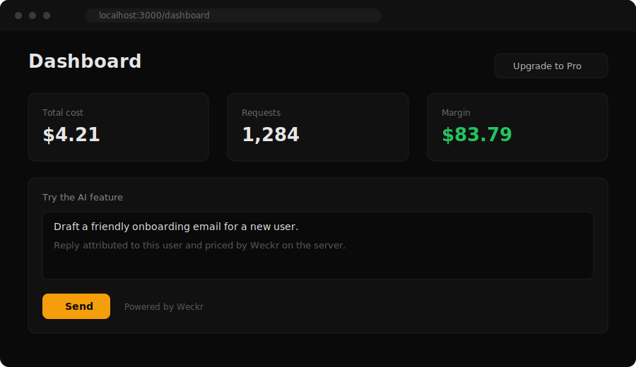

# Weckr Next.js AI SaaS Starter

The fastest way to ship an AI SaaS with cost and margin tracking built in from day one.

[](https://useweckr.com)
[](./LICENSE)



## What you get

* Next.js 14 app router, TypeScript, and Tailwind
* Supabase email and password auth
* Stripe checkout for one paid plan
* An OpenAI chat endpoint as the example AI feature
* Weckr already wrapping that endpoint, so cost and margin per user appear with no extra work

Everything is deliberately small. You can read the whole repo in about five minutes.

## The integration

This is the entire Weckr setup, and it lives in `app/api/chat/route.ts`:

```ts
import { Weckr } from '@weckr/sdk'

const wk = new Weckr({ apiKey: process.env.WECKR_API_KEY, plans: { free: 0, pro: 29 } })

const result = await wk.chat(openai, {
  model: 'gpt-4o-mini',
  messages,
  userId: user.id,
  feature: 'chat',
  plan: user.plan,
})
```

One wrapped call. Every request is now attributed to a user and a feature, priced on the server, and visible in your Weckr dashboard. As a bonus, the dashboard page reads those numbers back through `app/api/usage/route.ts` so you can see live cost and request counts inside the app.

## Quick start

1. Clone the repo.

```bash
git clone https://github.com/Ghiles3232/weckr-nextjs-starter.git
cd weckr-nextjs-starter
```

2. Install dependencies.

```bash
npm install
```

3. Copy the example env file and fill in your keys.

```bash
cp .env.example .env.local
```

You need a Weckr key, an OpenAI key, and your Supabase project url and anon key. Stripe is optional and only powers the upgrade button.

4. Run it.

```bash
npm run dev
```

Open http://localhost:3000, create an account, and send a message from the dashboard. Your first request shows up in the Weckr dashboard within seconds.

## What is Weckr

Weckr tells you which customers are quietly unprofitable, per user, per feature, per model call. You wrap your existing OpenAI, Anthropic, or Gemini client and Weckr tracks what each customer costs you in model spend against what they pay you. Learn more at [useweckr.com](https://useweckr.com).

Why is it already wired in? Because cost tracking added on day one is nearly free, while cost tracking bolted on after a surprise invoice is a scramble. This template makes the sensible default the easy one. Remove it in one line if you ever want to.

## License

MIT. Build on it, ship it, restyle it, and sell what you make. See [LICENSE](./LICENSE).

## Powered by Weckr

If you want to keep the badge, paste this at the bottom of your own README:

```md
[](https://useweckr.com)
```
